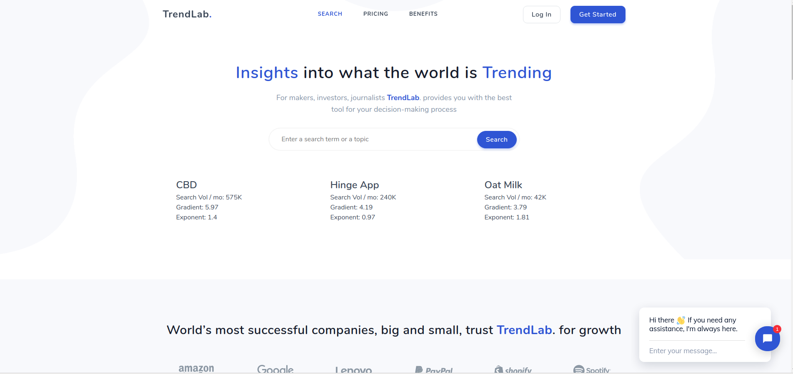

# TrendLab

Init commands:
python manage.py migrate --settings=TrendLab.settings.dev
python manage.py runserver --settings=TrendLab.settings.dev

### Setup steps
1. Create user pool, create lambda functions
2. Redirect user to correct site after signup
3. Confirm email to have any user registering
4. Input search and get result.

